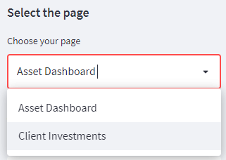
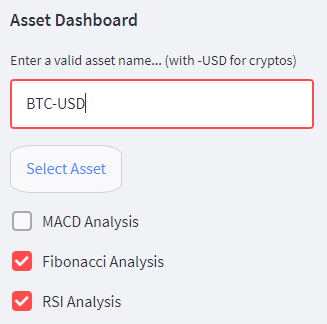
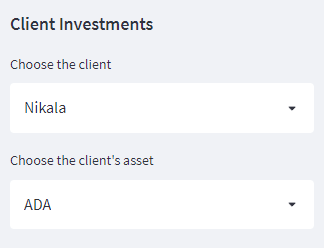

# BC5: Cryptocurrency Data Visualization Dashboard

**Group Name:** M Consulting
[**Link to Dashboard:**](https://share.streamlit.io/stoffelrenan/streamlit/main/streamlit.py)
**Submission date:** 30-05-2022 | 11.59pm

## Description

For our client, Investments4Some, we decided that a simpler design with fewer, 
more informative visualizations was the best dashboard design for their needs.
From a business perspective, the main information they needed from us, displayed
in the dashboard was the prediction, which we have provided for all ten original 
coins, as well as any asset, coin, or stock on yahoo finance website, so that 
this dashboard can grow with their client portfolios.

## Step 1: Select a page

The two page options are the asset overview, which provides the preditions for the 
selected coin for tomorrow and the day after tomorrow, a candlestick plot with 
adjustable timeline, and options for additional technical analysis indicators. 

Page two is the client information, with personal asset data displayed in an area 
plot, metrics, and a table. The guage plot shows asset performance over the last 30 
days based on % change. 

## Step 2: Type in asset name

This dashboard is designed to accept any yahoo finance symbol, including cryptocurrencies 
or stocks;:

Examples: 
Apple Inc. - 'AAPL'
Tesla 	   - 'TSLA'
Bitcoin    - 'BTC-USD'
Ethereum   - 'ETH-USD

**Note:** the dashboard will return an error if the symbol does not exist. Also, make sure to add the converted currency if you want to see a crypto asset. 

## Step 3: Customize your page 

If you are on the Asset Overview page, you can select from a number of technical
analysis indicators to show. 

If you are on the Client Investments page you can select which clients you would like to display
data about. Because this is internal to Investments4Some, we have included client names, 
but this can be changed if there are concerns over data privacy. 

## Resources: 

This dashboard was created and hosted in the cloud using [Streamlit](https://streamlit.io/)
